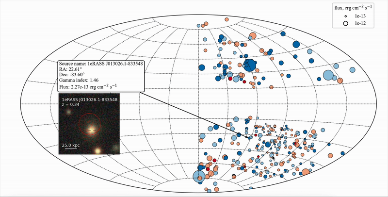

# eRO-ExTra Catalog

A catalog of 304 **Ex**tragalactic non-AGN X-ray **Tra**nsients and variables detected by the **eRO**SITA telescope during its first and second all-sky surveys (eRASS1 and eRASS2).

This repository provides the complete dataset, key analysis scripts, and visualizations associated with the eRO-ExTra catalog.

  

📄 **Full catalog description and methodology are available in our publication:**

📚 *Astronomy & Astrophysics*, 2025  
🔗 [Read the paper (PDF)](https://www.aanda.org/articles/aa/pdf/2025/01/aa51253-24.pdf)
